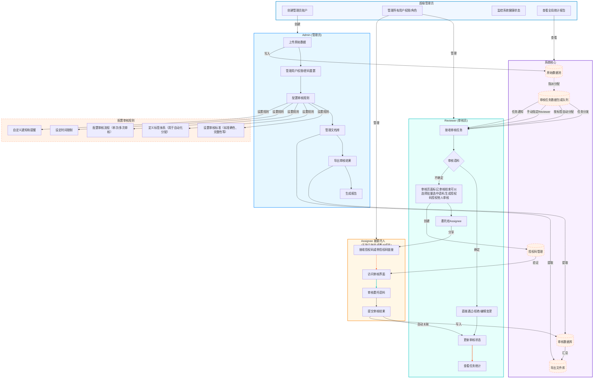

# 数据集审核平台 (Review Dataset Platform)

## 架构预览




## 快速开始

### 开发环境

#### 后端
```bash
cd backend
python -m venv venv
.\venv\Scripts\activate  # Windows
pip install -r requirements.txt
uvicorn app.main:app --reload
```
API文档: http://localhost:8000/docs

#### 前端
```bash
cd frontend
npm install
npm run dev
```
访问: http://localhost:3000

### Docker 部署
```bash
docker-compose up -d
```
访问: http://localhost

## 默认账户

首次使用需要通过 API 注册用户:
```bash
curl -X POST http://localhost:8000/api/v1/auth/register \
  -H "Content-Type: application/json" \
  -d '{"username": "admin", "email": "admin@example.com", "password": "admin123", "role": "super_admin"}'
```

## 项目结构

```
revdata/
├── backend/                 # FastAPI 后端
│   ├── app/
│   │   ├── api/            # API 路由
│   │   ├── core/           # 核心配置
│   │   ├── models/         # 数据库模型
│   │   ├── schemas/        # Pydantic 模式
│   │   └── main.py         # 应用入口
│   ├── requirements.txt
│   └── Dockerfile
├── frontend/                # React 前端
│   ├── src/
│   │   ├── components/     # 组件
│   │   ├── pages/          # 页面
│   │   ├── services/       # API 服务
│   │   ├── stores/         # 状态管理
│   │   └── App.tsx
│   ├── package.json
│   └── Dockerfile
└── docker-compose.yml
```

## 功能特性

### MVP 阶段 ✅
- [x] 用户认证 (登录/注册/JWT)
- [x] 数据集上传 (JSONL/JSON/CSV/TSV)
- [x] 卡片式审核界面
- [x] QA 对话左右分栏展示
- [x] 差异对比显示 (红绿高亮)
- [x] 快捷键支持 (PgUp/PgDn/Ctrl+Enter等)
- [x] 基础任务分配

## 快捷键

| 快捷键           | 功能         |
| ---------------- | ------------ |
| PgUp             | 上一条语料   |
| PgDn             | 下一条语料   |
| Ctrl+Enter       | 通过并下一条 |
| Ctrl+Shift+Enter | 拒绝并下一条 |
| Ctrl+E           | 进入编辑模式 |
| Alt+S            | 保存修改     |
| Esc              | 取消编辑     |

## API 文档

启动后端后访问: http://localhost:8000/docs

---

## VS Code 开发调试

### 推荐插件

首次打开项目时,VS Code 会提示安装推荐插件,点击"全部安装"即可。

### 调试配置

按 `F5` 或点击"运行和调试"面板,选择以下配置:

| 配置名称          | 说明                                           |
| ----------------- | ---------------------------------------------- |
| **后端: FastAPI** | 启动后端服务器并开启断点调试                   |
| **前端: Chrome**  | 启动 Chrome 调试前端 (需先启动前端 dev server) |
| **前端: Edge**    | 启动 Edge 调试前端                             |
| **全栈调试**      | 同时启动后端 + Chrome 调试                     |

### 任务 (Tasks)

按 `Ctrl+Shift+B` 运行默认任务 (全栈启动)，或按 `Ctrl+Shift+P` 输入 "Run Task" 选择:

| 任务名称                 | 说明                            |
| ------------------------ | ------------------------------- |
| **全栈: 启动开发环境**   | 同时启动前后端开发服务器 (默认) |
| **后端: 启动开发服务器** | 仅启动 FastAPI                  |
| **前端: 启动开发服务器** | 仅启动 Vite                     |
| **Docker: 启动全部服务** | docker-compose up -d            |
| **Docker: 重建并启动**   | docker-compose up -d --build    |

### 开发环境准备

```bash
# 1. 后端依赖
cd backend
python -m venv venv
.\venv\Scripts\activate  # Windows
pip install -r requirements.txt

# 2. 前端依赖
cd ../frontend
npm install

# 3. 启动数据库 (Docker)
docker-compose up -d postgres redis

# 4. 按 Ctrl+Shift+B 启动全栈开发
```

### 调试技巧

1. **后端断点**: 在 Python 代码中设置断点，选择"后端: FastAPI"启动
2. **前端断点**: 在 `.tsx` 文件中设置断点，先运行 `npm run dev`，再选择"前端: Chrome"
3. **API 测试**: 访问 http://localhost:8000/docs 使用 Swagger UI
4. **热重载**: 后端和前端都支持热重载，修改代码后自动生效
